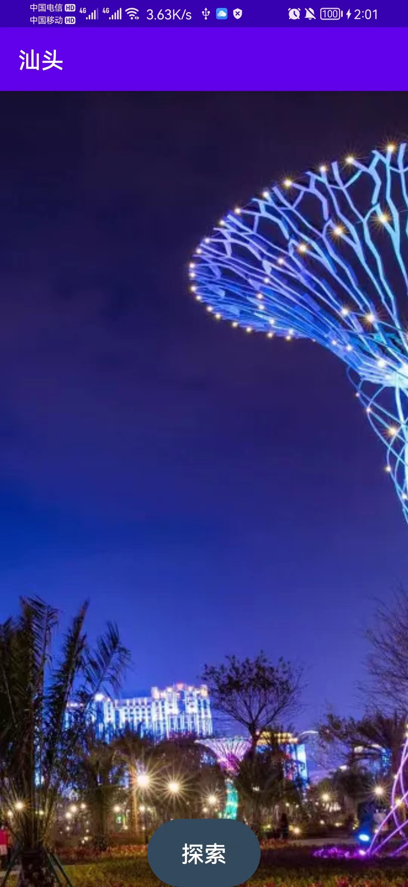
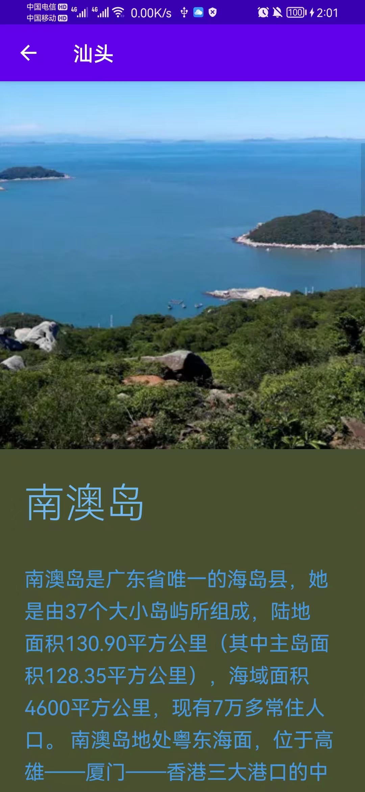

# 广东财经大学-人机交互-实验三作业
该项目为人机交互课程的实验三作业，要求开发一个静态的app软件

## 注意事项

### 运行方式 
加载到Android Studio中运行即可。
### 程序环境
该项目在Android X 环境下开发，基于java语法开发
## 程序截图
 
 
 
## 参考项目
[Panoramalmage](https://github.com/gjiazhe/PanoramaImageView)--设备旋转自动显示全景图片

[TransitionButton](https://github.com/roynx98/transition-button-android)--安卓过渡加载按钮

[MaterialWitness](https://github.com/unrarp/google-io-2014-compat)--UI系统设计框架
